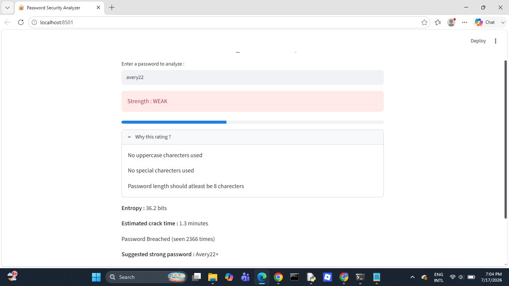
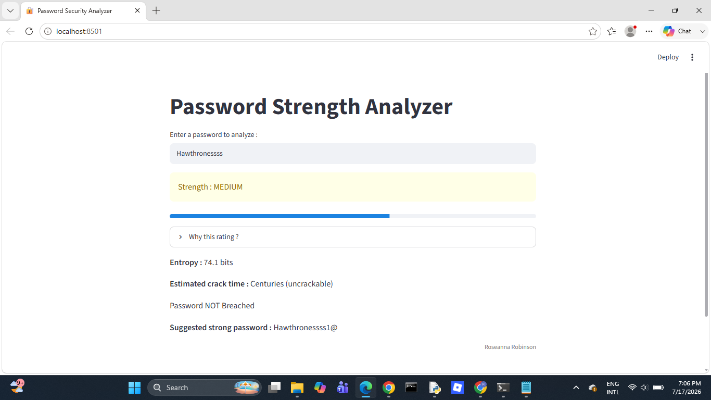
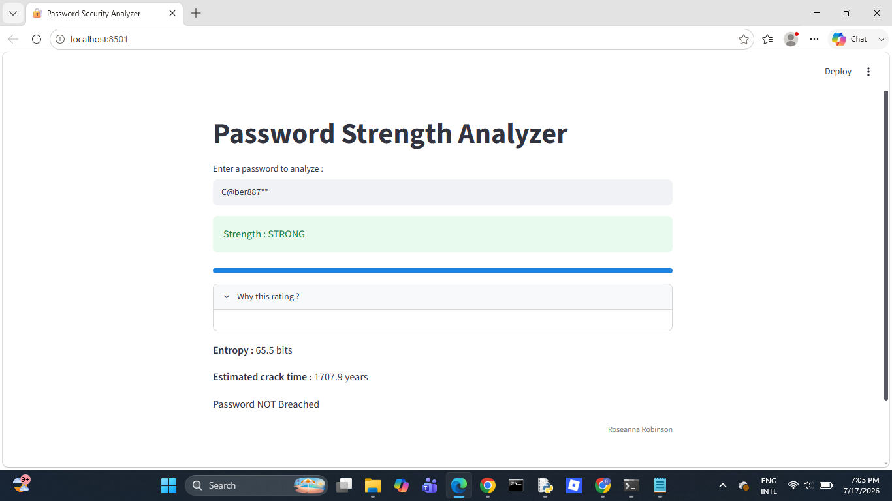

# 🔐 Password Strength Analyzer

A web app that analyzes password strength, estimates crack time, and checks for real world data breaches.

## About

This tool evaluates password security in real time. It classifies a password as STRONG, MEDIUM or WEAK based on its character composition, calculates entropy (a measure of unpredictability) and estimates how long it would take to crack via brute force. It also checks whether the password has appeared in known data breaches using the Have I Been Pwned API — using k-anonymity, so the actual password (or even its full hash) is never sent over the internet.

## Screenshots

### Weak Password


### Medium Password


### Strong Password


## Features

- Evaluates password strength (STRONG / MEDIUM / WEAK)
- Calculates entropy
- Estimates brute-force crack time
- Checks for known data breaches via the Have I Been Pwned API
- Suggests a stronger password based on the one entered
- Logs check history locally (without ever storing the actual password)

## Tech Stack

- Python
- Streamlit (web interface)
- Requests (API calls)
- hashlib (SHA-1 hashing)
- Have I Been Pwned API (breach checking)

## How to Run Locally

1. Clone this repository:
```
git clone https://github.com/Roseanna08/Password_Strength_Analyzer.git
```
2. Navigate into the project folder:
```
cd Password_Strength_Analyzer
```
3. Install the required dependencies:
```
pip install -r requirements.txt
```
4. Run the app:
```
streamlit run password_strength.py
```

## Future Improvements

- Deploy the app publicly via Streamlit Community Cloud
- Add a fully randomized password generator option
- Visualize password character composition with a chart
- Support checking multiple passwords at once
